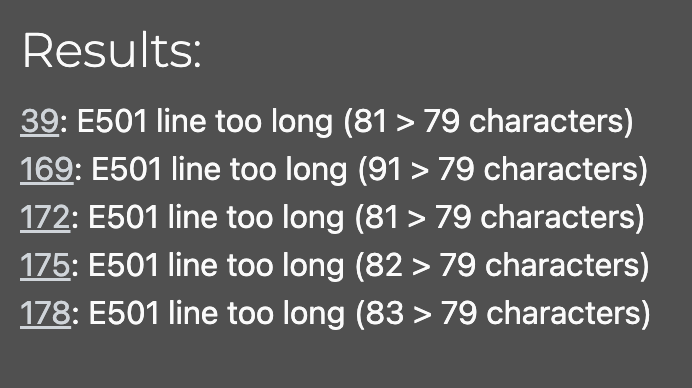

# Testing and Validation

## Contents

[Code Validation](#code-validation)

[Manual Testing](#manual-testing)

[Automated Testing](#automated-testing)

---

## Code Validation

All code has been passed through a Python Linter.

| App | file | outcome |
| --- | --- | --- |
| take_control_api | permissions.py | No errors |
| | settings.py | Errors, see below |
| | urls.py | No errors |
| | views.py | No errors |
| focus | models.py | No errors |
| | serializers.py | No errors |
| | tests.py | No errors |
| | urls.py | No errors |
| |  views.py | No errors |
| goal | models.py | No errors |
| | serializers.py | No errors |
| | tests.py | No errors |
| | urls.py | No errors |
| |  views.py | No errors |
| task | models.py | No errors |
| | serializers.py | No errors |
| | tests.py | No errors |
| | urls.py | No errors |
| |  views.py | No errors |

The following errors were returned for settings.py:

[Return to contents list](#contents)

## Manual Testing

Manual tests for all Endpoints have been carried out on the deployed site. Where endpoints have been utilised by the frontend, this has been tested to with results recorded.

### Authorisation

| url | http request | expected outcome | result | Frontend |
| --- | --- | --- | --- | --- |
| dj-rest-auth/registration/ | POST | New user created | PASS | PASS |
| | | Invalid fields handled | PASS | PASS |
| dj-rest-auth/login/ | POST | User Authenticated | PASS | PASS |
| | | Invalid fields handled | PASS | PASS |
| dj-rest-auth/logout/ | POST | User logged out and token object deleted | PASS | PASS |

Key notes:
While registration updates the database correctly a 500 error is thrown. See bug #1 in main readme.

### Focus model

| url | http request | expected outcome | result |Frontend |
| --- | --- | --- | --- | --- |
| focus/ | GET | Unauthorized error for logged out users | PASS | Handled by frontend logic |
| | | list of all logged in user's focus area and non of anyone elses | PASS | PASS |
| | | focus areas ordered by rank first and then by created_at in ascending order | PASS | Rank not utilised, but passes on ordering by ascending created_at |
| | POST | Unauthorized error for logged out users | PASS | Handled by frontend logic |
| | | Error message for empty name field | PASS | PASS |
| | | Error message for name over 50 characters | PASS | PASS |
| | | Error message for images too large | PASS | PASS |
| | | new focus created for logged in user | PASS | PASS |
| focus/<int:pk> | GET | Invalid focus request returns 404 | PASS | PASS |
| | | Logged in user can get their focus | PASS | PASS |
| | | Logged in user trying to get a focus that doesn't belong to them returns 403 error | PASS | PASS |
| | | Logged out user cannot make get request 401 error | PASS | PASS |
| | PUT | Logged in user can edit their focus | Fail in deployed API | PASS |
| | PATCH | Logged in user can edit their focus | Fail in deployed API | Unused end point |
| | DELETE | Logged in user can delete their focus | Fail in deployed API | PASS |

Key notes:
The endpoints which fail in deployed api do work when accessed from the frontend. The same issue was also found in the walkthrough api.

### Goal model

| url | http request | expected outcome | result |Frontend |
| --- | --- | --- | --- | --- |
| goals/ | GET | Unauthorized error for logged out users | PASS | Frontend logic already prevents this |
| | | list of all logged in user's goals and non of anyone elses | PASS | Goals are only ever retrieved by also using focus_id reference |
| | | goals ordered by deadline first and then by created_at in ascending order | PASS | PASS |
| goals/?parent=None | GET | list of all user's goals which don't have a parent | PASS | Unused endpoint |
| goals/?parent_id=<> | GET | list of all user's goals which are nested in parent given | PASS | Unused endpoint |
| goals/?focus_id=<> | GET | list of all user's goals with focus given | PASS | PASS |
| goals/?focus_id=<>&parent=None | GET | list of all user's goals with focus given and which don't have a parent | PASS | Unused end point |
| | POST | Unauthorized error for logged out users | PASS | Handled by frontend logic |
| | | Error message for empty title field | PASS | PASS |
| | | Error message for name over 50 characters | PASS | PASS |
| | | new goal created for logged in user | PASS | PASS |
| goals/<int:pk> | GET | Invalid goal request returns 404 | PASS | Unused endpoint |
| | | Logged in user can get their goal | PASS | Unused endpoint |
| | | Logged in user trying to get a goal that doesn't belong to them returns 403 error | PASS | Unused endpoint |
| | | Logged out user cannot make get request 401 error | PASS | Unused endpoint |
| | PUT | Logged in user can edit their goal | Fail in deployed API | PASS |
| | PATCH | Logged in user can edit their goal | Fail in deployed API | Unused endpoint |
| | DELETE | Logged in user can delete their goal | Fail in deployed API | PASS |

Key notes:
The endpoints which fail in deployed api do work when accessed from the frontend. The same issue was also found in the walkthrough api.

### Task model

| url | http request | expected outcome | result |Frontend |
| --- | --- | --- | --- | --- |
| tasks/ | GET | Unauthorized error for logged out users | PASS | Frontend logic already prevents this |
| | | List all logged in user's tasks and non of anyone elses | PASS | PASS |
| | | Tasks ordered by deadline first and then by linked goal deadline | PASS | PASS |
| tasks/ | POST | New task created for logged in user | PASS | PASS |
| | | Error for empty name field | PASS | PASS |
| | | Error for over 100 characters in name field | PASS | PASS |
| tasks/?active=True | GET | List all user's active tasks | PASS | Unused endpoint |
| tasks/?active=False | GET | List all user's non-active tasks | PASS | Unused endpoint |
| tasks/?today=True | GET | List all user's today tasks | PASS | Unused endpoint |
| tasks/?today=False | GET | List all user's non-today tasks | PASS | Unused endpoint |
| tasks/?achieved=True | GET | List all user's achieved tasks | PASS | Unused endpoint |
| tasks/?achieved=False | GET | List all user's not-achieved tasks | PASS | Unused endpoint |
| tasks/?today=True&achieved=False | GET | List all user's today tasks that haven't been achieved | PASS | Unused endpoint |
| tasks/?focus=None | GET | List all user's miscellaneous tasks | PASS | PASS |
| tasks/?focus=<> | GET | List all user's tasks for a given focus | PASS | PASS |
| tasks/?goal=None | GET | List all user's tasks without a goal | PASS | PASS |
| tasks/?goal=<> | GET | List all user's tasks for a given goal | PASS | PASS |
| tasks/?focus=<>&goal=None | GET | List all user's day-to-day tasks for a given focus | PASS | PASS |
| tasks/?ordering=updated_at | GET | List all user's tasks in order of updated_at | PASS | Unused endpoint |
| tasks/?ordering=focus | GET | List all user's tasks in order of thier linked focus rank | PASS | PASS |
| tasks/?ordering=goal__deadline | GET | List all user's tasks in order of their linked goal's deadline | PASS | PASS |
| tasks/?ordering=deadline | GET | List all user's tasks in order of deadline | PASS | PASS |
| tasks/?ordering=created_at | GET | List all user's tasks in order of created_at | PASS | PASS |
| tasks/?search= | GET | List all user's tasks where the search parameter matches either the task name, linked focus name or linked goal title | PASS | PASS |
| tasks/<int:pk> | GET | Invalid task request returns 404 | PASS | Unused endpoint |
| | | Logged in user can get their task | PASS | Unused endpoint |
| | | Logged in user trying to get a task that doesn't belong to them returns 403 error | PASS | Unused endpoint |
| | | Logged out user cannot make get request 401 error | PASS | Unused endpoint |
| | PUT | Logged in user can edit their task | Fail in deployed API | PASS |
| | PATCH | Logged in user can edit their task | Fail in deployed API | PASS |
| | DELETE | Logged in user can delete their task | Fail in deployed API | PASS |

Key notes:
The endpoints which fail in deployed api do work when accessed from the frontend. The same issue was also found in the walkthrough api.

[Return to contents list](#contents)

## Automated Testing

Automated tests have been created for all views. These tests cover:

- Access of logged in and logged out users
- Access of owners and non-owners
- POST, GET, PATCH and DELETE request methods
- Filtering methods

The tests don't cover the following due to the extra complexity and time needed to write the tests. These have all been fully tested using manual testing:

- PUT request methods
- Ordering methods

### FocusListView

| Test name | Description | Outcome |
| --- | ---- | -- |
| test_logged_out_no_create_focus | Not logged in user sending HTTP post request, should return 403 error | Pass |
| test_logged_out_no_view_focus_list | Not logged in user sending HTTP get request, should return 403 error | Pass |
| test_logged_in_can_create_focus | Logged in user sending a post request with name and why, should return 201 and create new focus | Pass |
| test_focus_create_no_name_throws_error | Logged in user sending post request without name data, should return 400 error | Pass |
| test_focus_view_own_focus_only | Logged in user sending get request, receives only their focuses | Pass |

### FocusDetailView

| Test name | Description | Outcome |
| --- | ---- | -- |
| test_logged_in_can_get_their_focus_detail | Logged in user sending a get request for a focus they own, should return focus | Pass |
| test_logged_out_no_access_focus_detail | Logged out user sending a get request for a focus, should return access denied | Pass |
| test_invalid_focus_request_handled | Logged in user sending a get request for a focus that doesn't exist, should return 404 not found | Pass |
| test_logged_in_denied_get_focus_dont_own | Logged in user sending get request for focus they don't own, should return access denied | Pass |
| test_logged_in_owner_can_edit_their_focus | Logged in user sending a put request for owned focus, should return ok and make changes | Pass |
| test_logged_in_owner_denied_edit_focus_dont_own | Logged in user sending a put request for focus they dont own, should return access denied | Pass |
| test_logged_in_owner_can_delete_their_focus | Logged in user sending a delete request for owned focus, should return ok and delete focus | Pass |
| test_logged_in_owner_denied_delete_focus_dont_own | Logged in user sending a delete request for focus they don't own, should return access denied | Pass |

### GoalListView

| Test name | Description | Outcome |
| --- | ---- | -- |
| test_logged_out_no_create_goal | Not logged in user sending HTTP post request, should return 403 error | Pass |
| test_logged_in_can_create_goal | Logged in user sending a post request with title, should return 201 and create | Pass |
| test_goal_create_no_title_throws_error | Logged in user sending post request without name data, should return 400 error | Pass |
| test_logged_out_no_view_goal_list | Not logged in user sending HTTP get request, should recieve 403 error | Pass |
| test_view_own_goals_only | Logged in user sending get request, receives only their goals | Pass |
| test_filter_by_parent_is_none | Logged in user can request only goals with no parent | Pass |
| test_filter_by_parent_id | Logged in user can request children goals of a specified parent | Pass |
| test_filter_by_focus_id | Logged in user can request goals linked to a specific focus | Pass |

### GoalDetailView

| Test name | Description | Outcome |
| --- | ---- | -- |
| test_logged_out_no_access_goal_detail | Logged out user sending a get request for a goal, should recieve access denied | Pass |
| test_logged_in_can_get_their_goal | Logged in user sending a get request for a goal they own, should return goal | Pass |
| test_logged_in_denied_goal_dont_own | Logged in user sending get request for goal they don't own, should return access denied. | Pass |
| test_invalid_goal_request_handled | Logged in user sending a get request for a goal that doesn't exist, should return 404 not found | Pass |
| test_logged_in_owner_can_edit_their_goal | Logged in user sending a patch request for owned goal, should return ok and make changes | Pass |
| test_logged_in_owner_denied_edit_goal_dont_own | Logged in user sending a patch request for goal they dont own, should return access denied | Pass |
| test_logged_in_owner_can_delete_their_goal | Logged in user sending a delete request for owned goal, should return ok and delete focus | Pass |
| test_logged_in_owner_denied_delete_goal_dont_own | Logged in user sending a delete request for goal they don't own, should return access denied | Pass |

### TaskListView

| Test name | Description | Outcome |
| --- | ---- | -- |
| test_logged_out_no_create_task | Not logged in user sending HTTP post request, should return 403 error | Pass |
| test_logged_in_can_create_task | Logged in user sending a post request with name, should return 201 and create | Pass |
| test_logged_out_no_view_task_list | Not logged in user sending a get request should recieve 403 error | Pass |
| test_view_own_tasks_only | Logged in user sending get request, receives only their tasks | Pass |
| test_filter_tasks_by_active | Logged in user can request only their active tasks | Pass |
| test_filter_tasks_by_today | Logged in user can request only their today tasks | Pass |
| test_filter_tasks_by_achieved | Logged in user can request only their achieved tasks | Pass |
| test_filter_by_miscellaneous | Logged in user can request only their tasks with no focus | Pass |
| test_filter_by_focus | Logged in user can request all the tasks from one of their focus areas | Pass |
| test_filter_by_no_goal | Logged in user can request all tasks without a goal | Pass |
| test_filter_by_goal | Logged in user can request all tasks linked to a goal | Pass |
| test_filter_by_search | Logged in user can filter tasks by search query | Pass |

### TaskDetailView

| Test name | Description | Outcome |
| --- | --- | --- |
| test_logged_out_no_access_task_detail | Logged out user sending a get request for a task, should recieve access denied | Pass |
| test_logged_in_can_get_their_task | Logged in user sending a get request for a task they own, should return task | Pass |
| test_logged_in_denied_task_dont_own | Logged in user sending get request for task they don't own, should return access denied | Pass |
| test_invalid_task_request_handled | Logged in user sending a get request for a task that doesn't exist, should return 404 not found | Pass |
| test_logged_in_owner_can_edit_their_task | Logged in user sending a patch request for owned task, should return ok and make changes | Pass |
| test_logged_in_owner_denied_edit_task_dont_own | Logged in user sending a patch request for task they dont own, should return access denied. | Pass |
| test_logged_in_owner_can_delete_their_task | Logged in user sending a delete request for owned task, should return ok and delete task | Pass |
| test_logged_in_owner_denied_delete_task_dont_own | Logged in user sending a delete request for task they don't own, should return access denied | Pass |

[Return to contents list](#contents)
